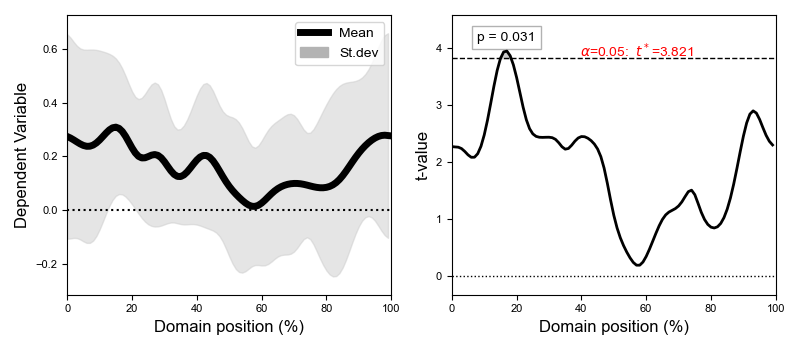

# spm1d

One-Dimensional <b>Statistical Parametric Mapping</b> in Python and MATLAB.

 

 

spm1d uses [random field theory](https://spm1d.org/rft1d/) expectations regarding the behavior of smooth, one-dimensional Gaussian fields to make statistical inferences regarding a set of one-dimensional continua.

 
 

Documentation: [spm1d.org](http://spm1d.org)

MATLAB source code: [spm1dmatlab](https://github.com/0todd0000/spm1dmatlab)

 
 

## Support

Please report software bugs or other problems by searching existing issues or creating a new issue [here](https://github.com/0todd0000/spm1d/issues).

 
 

## License

spm1d is a package for one-dimensional Statistical Parametric Mapping (SPM). spm1d uses random field theory expectations regarding smooth, one-dimensional (random) Gaussian fields to make statistical inferences regarding a set of 1D measurements.

    Copyright (C) 2023  Todd Pataky

    This program is free software: you can redistribute it and/or modify
    it under the terms of the GNU General Public License as published by
    the Free Software Foundation, either version 3 of the License, or
    (at your option) any later version.

    This program is distributed in the hope that it will be useful,
    but WITHOUT ANY WARRANTY; without even the implied warranty of
    MERCHANTABILITY or FITNESS FOR A PARTICULAR PURPOSE.  See the
    GNU General Public License for more details.

    You should have received a copy of the GNU General Public License
    along with this program.  If not, see <http://www.gnu.org/licenses/>.